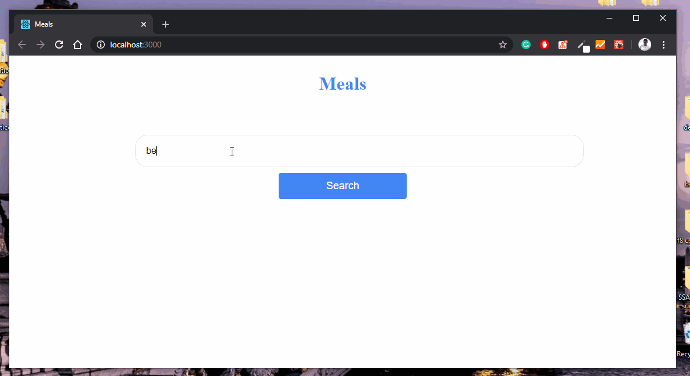

# Meal Search App

This is a simple React JS application that illustrates how to perform a search. In this application, I query one of the [themealdb.com](https://www.themealdb.com/) APIs that returns an array of meals which we display.

## Demo of the application

## To install and run project locally

    $ git clone https://github.com/lytes20/search-app-react.git
    $ cd meal-search
    $ yarn
    $ yarn start